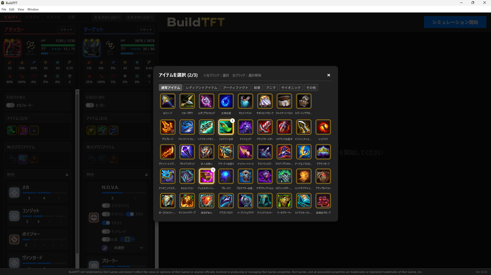
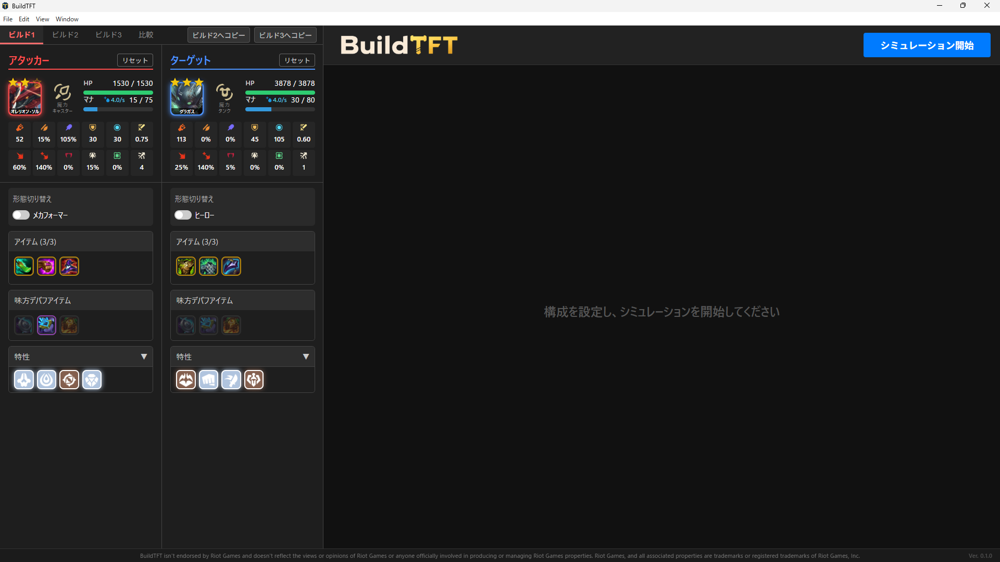
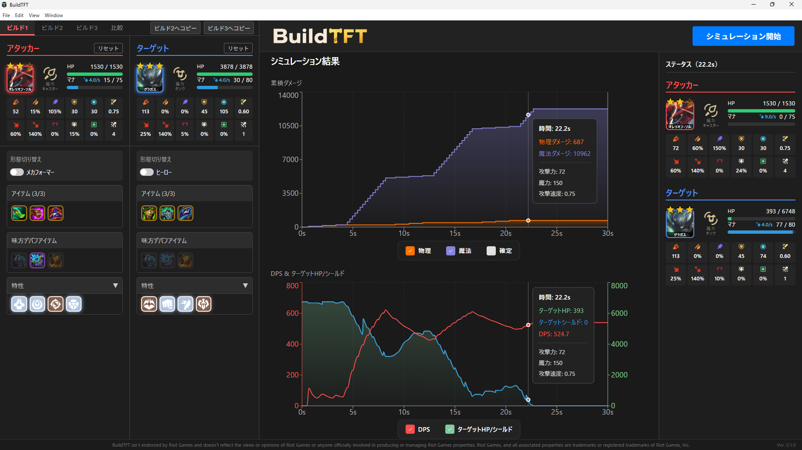
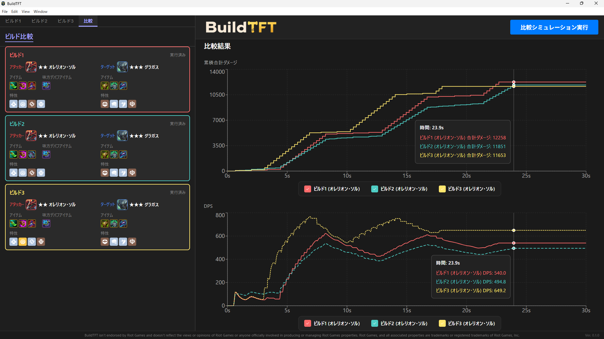

# BuildTFT - TFTダメージシミュレータ

TFT（Teamfight Tactics）のダメージ計算、ステータス計算、装備シミュレーションを行うためのデスクトップアプリケーションです。
戦闘は1v1を想定しており、アタッカーがターゲットに与えるダメージを詳細に可視化し、最適なビルドの検証に役立ちます。

---

## 📥 インストール方法（Windows）

1. [Releases ページ](https://github.com/meteoji/BuildTFT/releases) にアクセスします。
2. 最新のリリース（例: `v0.1.0`）から **`BuildTFT Setup 0.1.0.exe`** をダウンロードします。
3. ダウンロードした `.exe` ファイルを実行すると、セットアップウィザードが起動します。画面の指示に従ってインストールを完了してください。

> [!NOTE]
> **Windows SmartScreen やウイルス対策ソフトによるブロックについて**
> 本アプリは個人開発かつデジタル署名を購入していないため、起動時に「WindowsによってPCが保護されました」等の警告が表示される場合があります。
> 安全性には問題ありませんので、画面内の「**詳細情報**」をクリックし、「**実行**」ボタンを押して進めてください。

---

## ✨ 主な機能

* **チャンピオンのステータス計算**: アイテム、特性、スキル効果などを加味した実数値の算出。
* **詳細なダメージ計算**: 通常攻撃やスキルがターゲットに与えるダメージ、防御ステータスによる軽減、負傷・細断などのデバフや行動阻害（CC）の影響をシミュレート。
* **ビルド検証**: アイテムや特性の組み合わせごとの戦闘時間あたりのDPS比較。
* **自動アップデート**: アプリ起動時にバックグラウンドで自動的にアップデートが検知・適用されます（手動で毎回インストーラーをダウンロードし直す必要はありません）。

---

## 📖 使い方 (Usage)

### STEP 1: アタッカーとターゲットの設定
画面左側の「アタッカー」と「ターゲット」パネルから、シミュレーションを行うチャンピオンを選択します。
スターレベル（★1〜★3）、装備アイテム（最大3枠）、発動させたい特性を選択し、ステータスの変化を確認します。

### STEP 2: シミュレーションの実行
設定が完了したら、画面右上にある「**シミュレーション開始**」ボタンをクリックします。計算エンジンがバックグラウンドで即座に戦闘シミュレーションを実行します。

### STEP 3: 結果（グラフ・ステータス詳細）の確認
シミュレーション終了後、中央パネルに結果がグラフで出力されます。
* **累積与ダメージ推移グラフ**: アタッカーが与えるダメージをダメージタイプごとに時系列で確認できます。
* **DPS・ターゲットHP推移グラフ**: 時間経過による秒間ダメージとターゲットHPの変化を時系列で確認できます。

グラフにマウスオーバーすると、ポップアップが出現し、その時点でのダメージタイプごとの累積与ダメージ、DPS、ターゲットHP（シールド）が表示されます。
同時に右側パネルにはその時点のアタッカー、ターゲットのステータスが表示されます。

### STEP 4: 複数ビルドの比較
上部タブで「ビルド1」「ビルド2」「ビルド3」を作成し、タブを「**比較**」に切り替えて「**比較シミュレーション実行**」をクリックします。
異なるアイテム構成やスターレベル、発動特性による与ダメージ、DPSの推移を、1つのグラフ上に重ね合わせて比較検討できます。

---

## 🖥️ 動作環境

* **対応OS**: Windows 10 / 11 (64bit)

---

## ⚠️ 免責事項
* BuildTFT isn't endorsed by Riot Games and doesn't reflect the views or opinions of Riot Games or anyone officially involved in producing or managing Riot Games properties. Riot Games, and all associated properties are trademarks or registered trademarks of Riot Games, Inc.
* ダメージやステータスの計算結果は実際のゲーム内挙動と一致するよう最善を尽くしていますが、ゲームのアップデートや複雑なシナジーの状況により実際のゲーム内と若干の誤差が生じる場合があります。予めご了承ください。
